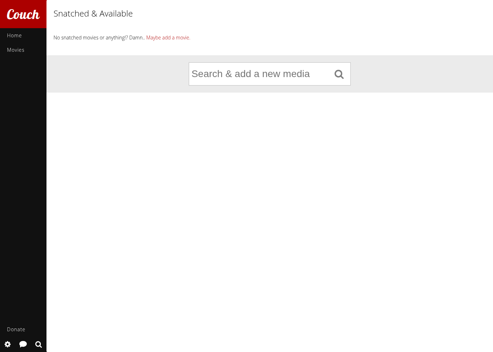
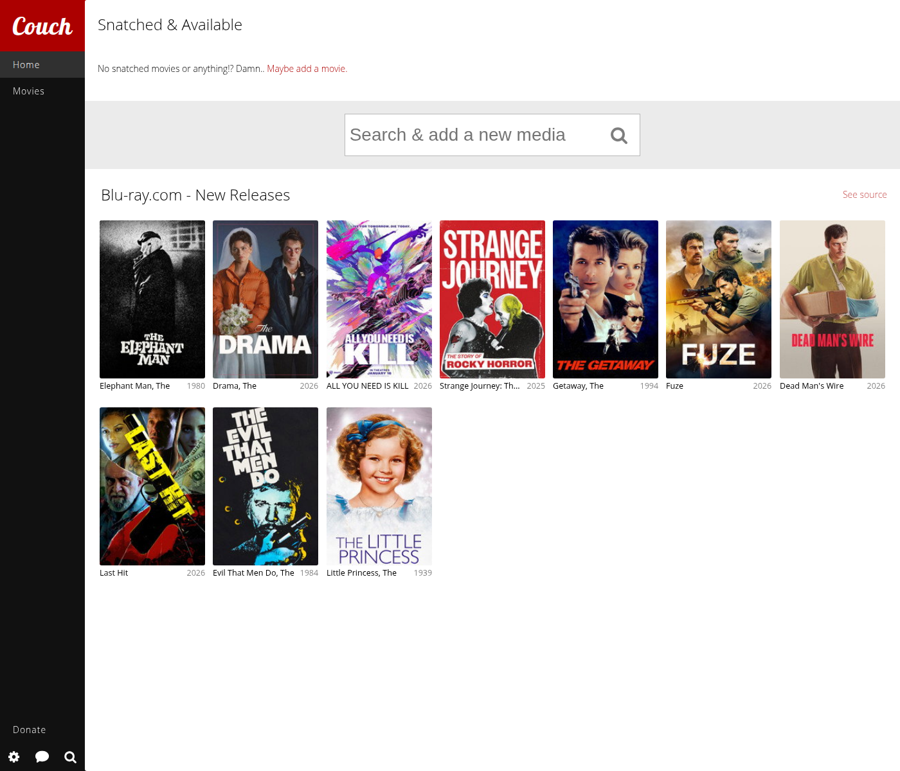
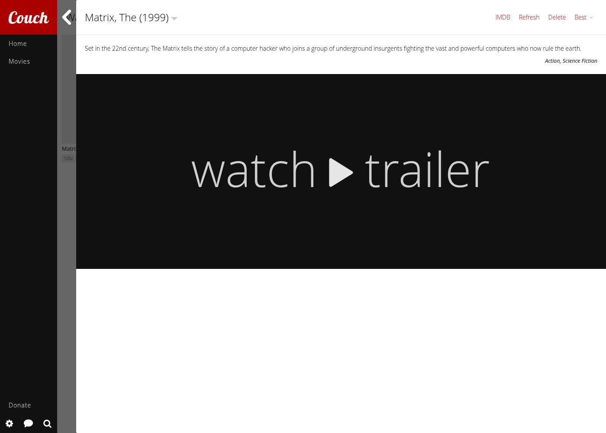

  

<h1 align="center">CouchTomato</h1>

  
  
  

  A Python 3 port and rebrand of <a href="https://github.com/CouchPotato/CouchPotatoServer">CouchPotato</a>,
  the automatic NZB and torrent movie downloader.

CouchPotato stopped receiving updates in 2020 while still stuck on Python 2, with its dependencies
vendored in-tree instead of pip-installed. CouchTomato keeps the entire original commit history intact
(see [`CLAUDE.md`](CLAUDE.md) for the full porting log) while bringing the codebase forward to
Python 3, replacing dead vendored dependencies with maintained pip packages, and working toward full
feature parity with upstream.

Keep a "movies I want"-list, and CouchTomato searches for NZBs/torrents of those movies on a schedule.
Once a good release is found, it's sent straight to your download client, then automatically renamed
and moved into your library once it finishes downloading.

## What Now?

* **[Download the latest release](https://github.com/CouchTomatoes/CouchTomatoServer/releases/latest)** —
  Windows installer/zip, macOS universal2 DMG, or Linux tar.gz/AppImage
* **[Wiki: Installation guide](https://github.com/CouchTomatoes/CouchTomatoServer/wiki/Installation)** — per-platform setup instructions
* **[Wiki: Migrating from CouchPotato](https://github.com/CouchTomatoes/CouchTomatoServer/wiki/Migration)**
* **[Wiki: FAQ / Troubleshooting](https://github.com/CouchTomatoes/CouchTomatoServer/wiki/FAQ)**
* **[Wiki: Architecture & porting status](https://github.com/CouchTomatoes/CouchTomatoServer/wiki/Architecture-Overview)**
* **[TODO.md](TODO.md)** — checkbox-tracked list of what's left for full parity with upstream

## Providers & Downloaders

CouchTomato searches across a wide range of torrent and NZB sites, and can hand releases off to
whichever download client you already run.

**Torrent providers:** AlphaRatio, AwesomeHD, BitHDTV, Bitsoup, HD4Free, HDBits, IPTorrents,
ILoveTorrents, KickAssTorrents, MagnetDL, MoreThanTV, PassThePopcorn, RARBG, SceneAccess, SceneTime,
ThePirateBay, TorrentBytes, TorrentDay, TorrentLeech, TorrentPotato, TorrentShack, Torrentz, YTS

**NZB providers:** Binsearch, NZBClub, NZBGet-compatible Newznab indexers, OMGWTFNZBS

**Download clients:** Transmission, Deluge, qBittorrent, rTorrent, uTorrent, NZBGet, NZBVortex,
Hadouken, Synology, put.io, SABnzbd, Blackhole

**Notifications:** see `couchpotato/core/notifications/` for the full list (Plex, Kodi/XBMC, Pushover,
Twitter, and more)

## Screenshots

| Setup wizard | Home page charts | Movie detail |
|---|---|---|
|  |  |  |

More in [`docs/screenshots/`](docs/screenshots/), captured during real browser-driven testing sessions
(see that folder's README for the full list and what each one verifies).

> **Note on the CouchPotatoApi provider:** upstream CouchPotato shipped with a built-in provider
> (`couchpotato/core/media/movie/providers/info/couchpotatoapi.py`) that calls a hosted backend at
> `api.couchpota.to` for search suggestions, release validation, ETA data, and update messages. That domain
> is now parked/for sale and the hosted service is gone, so this provider fails in CouchTomato. The backend's
> source code is still available at [CouchPotato/CouchPotatoAPI](https://github.com/CouchPotato/CouchPotatoAPI)
> if it's ever worth self-hosting a replacement; tracked as a known issue rather than something fixable by a
> client-side code change alone. That repo is archived (read-only since 2021), Node.js/Express, has no
> license file, and its own README admits setup isn't documented ("I don't really have the steps on how to
> get it running") — self-hosting it would mean reverse-engineering an abandoned app, not a quick deploy.

## Running from Source

CouchTomato requires **Python 3.11+**. It can be run from source, and will use *git* as an updater, so make
sure that is installed too.

* Install [Python 3.11+](https://www.python.org/downloads/) and [git](https://git-scm.com/)
* Clone the repo: `git clone https://github.com/CouchTomatoes/CouchTomatoServer.git`
* Install dependencies: `pip install -r requirements.txt`
* Start it: `python3 CouchTomatoServer/CouchPotato.py`
* Your browser should open up, but if it doesn't go to `http://localhost:5050/`

Prefer a packaged build instead? See the [Installation wiki page](https://github.com/CouchTomatoes/CouchTomatoServer/wiki/Installation) for
platform-specific installers, or the [latest release](https://github.com/CouchTomatoes/CouchTomatoServer/releases/latest)
directly.

Docker:
* You can adapt the community CouchPotato Docker images (e.g. [linuxserver.io](https://github.com/linuxserver/docker-couchpotato)) as a starting point — CouchTomato hasn't published its own image yet, see `TODO.md`.

## Development

Be sure you're running Python 3.11 or newer.

If you're going to add styling or doing some javascript work you'll need a few tools that build and compress scss -> css and combine the javascript files. [Node/NPM](https://nodejs.org/), [Grunt](http://gruntjs.com/installing-grunt), [Compass](http://compass-style.org/install/)

After you've got these tools you can install the packages using `npm install`. Once this process has finished you can start CouchTomato using the command `grunt`. This will start all the needed tools and watches any files for changes.
You can now change css and javascript and it wil reload the page when needed.

By default it will combine files used in the core folder. If you're adding a new .scss or .js file, you might need to add it and then restart the grunt process for it to combine it properly.

Don't forget to enable development inside the settings. This disables some functions and also makes sure javascript errors are pushed to console instead of the log.

## Project status

This is an active port — see [`CLAUDE.md`](CLAUDE.md) for the full history/architecture notes,
the [Architecture Overview wiki page](https://github.com/CouchTomatoes/CouchTomatoServer/wiki/Architecture-Overview)
for a higher-level summary, and [`TODO.md`](TODO.md) for a checkbox-tracked list of what's left to
reach full feature parity with upstream CouchPotato.

## Release History

Full release notes and downloads are on the [Releases page](https://github.com/CouchTomatoes/CouchTomatoServer/releases).
Short summary of what changed and which platforms had working installer/build downloads at each version:

| Version | Highlights | Downloads available |
|---|---|---|
| [v4.0.18](https://github.com/CouchTomatoes/CouchTomatoServer/releases/tag/v4.0.18) | Fixed `lipo` rejecting an identical vendored binary — full platform matrix finally green | **All platforms**: Windows x64 (installer + zip) & arm64 (zip), Linux x64 & arm64 (tar.gz + AppImage), **macOS universal2** (DMG + app.tar.gz — Intel + Apple Silicon combined) |
| [v4.0.17](https://github.com/CouchTomatoes/CouchTomatoServer/releases/tag/v4.0.17) | Fixed missing `dist/` dir in the macOS merge job | Windows x64/arm64, Linux x64/arm64 — macOS still missing (lipo bug) |
| [v4.0.16](https://github.com/CouchTomatoes/CouchTomatoServer/releases/tag/v4.0.16) | Fixed retired `macos-13` GitHub Actions runner label | Windows x64/arm64, Linux x64/arm64 — macOS still missing (dist/ bug) |
| [v4.0.15](https://github.com/CouchTomatoes/CouchTomatoServer/releases/tag/v4.0.15) | Expanded release pipeline to a full platform/arch matrix | Windows x64/arm64, Linux x64/arm64 — macOS job never ran (runner retired) |
| [v4.0.14](https://github.com/CouchTomatoes/CouchTomatoServer/releases/tag/v4.0.14) | Fixed a `RecursionError` in vendored `dateutil` + a Python 3.10 `collections` removal | Windows installer (.exe), macOS DMG (Apple Silicon only) |
| [v4.0.13](https://github.com/CouchTomatoes/CouchTomatoServer/releases/tag/v4.0.13) | Fixed macOS build failing on `.app` icon conversion | Windows installer (.exe), macOS DMG (Apple Silicon only) |
| [v4.0.12](https://github.com/CouchTomatoes/CouchTomatoServer/releases/tag/v4.0.12) | First Windows/macOS installer builds attached to a release | Windows installer (.exe) — macOS build failed (icon bug) |
| v4.0.4 – v4.0.11 | Core Python 3 porting: DB race fix, download-to-library pipeline bugs, wizard crashes, release-notes automation fixes | Source only (no packaged builds yet) |
| v4.0.0 – v4.0.3 | Initial CouchTomato numbering; release automation and CouchPotatoAPI status docs | Source only (no packaged builds yet) |

For the pre-rebrand CouchPotato history (`build/2.x`–`build/3.x` tags), see the
[full release list](https://github.com/CouchTomatoes/CouchTomatoServer/releases).

## Community

Found a bug or have a question? [Open an issue](https://github.com/CouchTomatoes/CouchTomatoServer/issues) —
check the [FAQ](https://github.com/CouchTomatoes/CouchTomatoServer/wiki/FAQ) and [`TODO.md`](TODO.md)
first in case it's already a known, tracked item.
</content>
